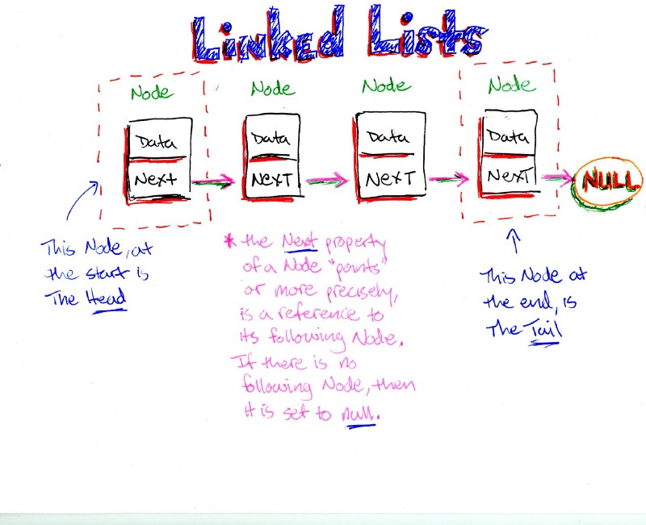

### Front end test

The test is splitted in three parts
- creation of a linked list and tool functions to manipulate them
- two react components to display a linked list
- improve the react components style

Some parts of the code *are dirty* on purpose :)

## Part 1:

We want you to develop a library to handle linked lists in typescript. Some functions are already written.
You should :
- Write the missing functions
- Make sure every unit test passes

[more info about linked list](https://en.wikipedia.org/wiki/Linked_list)

run tests 
`./node_modules/jest/bin/jest.js`

transpile code
`npx webpack`
